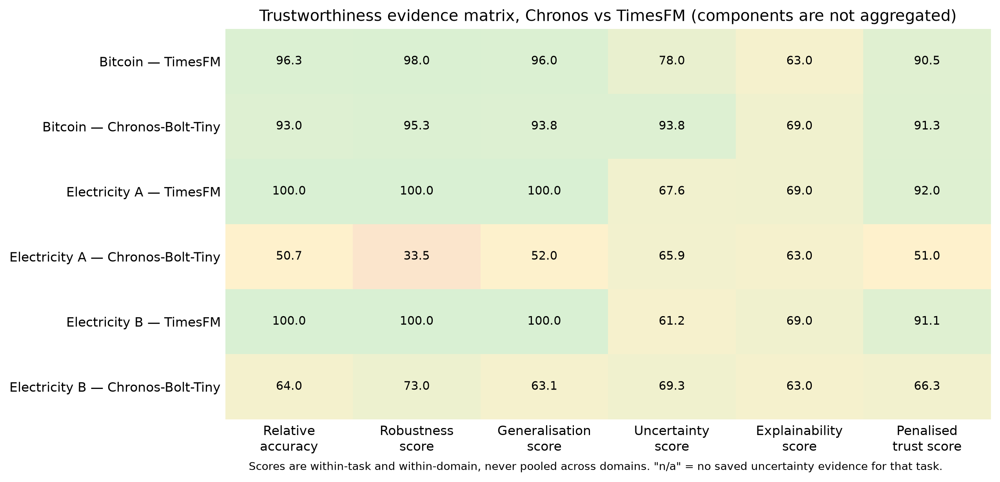

# Trustworthy Foundation Models for Time-Series Forecasting:
## Evaluating Accuracy, Robustness, and Uncertainty Across Domains

**Cross-Domain Empirical Study | Time-Series Foundation Models | Trustworthy AI | Forecasting | Uncertainty | Reproducibility**

Time-series foundation models can forecast new series without task-specific training. This makes them attractive when building and maintaining a separate model is costly.

The main question is simple. When can these models be trusted relative to strong conventional methods? Accuracy matters, but it does not tell the whole story. A model may perform well on average yet fail during difficult periods. It may also be unstable or produce unreliable prediction intervals.

The completed work covers daily Bitcoin prices and half-hourly South Australian electricity demand. Chronos-Bolt-Tiny and TimesFM are evaluated alongside simple baselines, statistical methods, and supervised neural models. Weather and Transport are planned extensions.

## Research Question

> Under what domain, horizon, regime, and information-update conditions can zero-shot time-series foundation models be considered trustworthy relative to strong conventional forecasting methods?

The secondary questions are:

1. Do accuracy rankings remain stable across domains and protocols?
2. How do models perform during difficult regimes?
3. Is performance stable across the test period?
4. Are prediction intervals reasonably calibrated?
5. Can the forecasts and supporting evidence be inspected and reproduced?
6. Are loss differences statistically and practically meaningful?

## Why This Research Matters

Accuracy alone does not tell the whole story. A low average error may hide poor performance during volatility, peaks, or large movements. Rankings may also change when the horizon or available information changes.

Uncertainty is another concern. A point forecast can be accurate while its interval is poorly calibrated. Simple models may also remain difficult to beat, especially when a series is highly persistent.

| Conventional benchmarking | This research |
|---|---|
| Aggregate error | Aggregate and conditional error |
| One leaderboard | Domain- and protocol-specific rankings |
| Point forecasts | Point forecasts and preserved uncertainty evidence |
| Average performance | Regime-conditional and temporal performance |
| Reproduction assumed | Forecast identity and artifact integrity checked |
| P-values alone | Dependence-aware tests, multiplicity correction, and effect sizes |

## Research Design

```text
Canonical domain data
        ↓
EDA, data quality, and chronological partitions
        ↓
Forecasting protocol and information boundary
        ↓
Deterministic │ Statistical │ Supervised Neural │ Foundation Models
        ↓
Frozen, validated forecast evidence
        ↓
Accuracy ─┬─ Regime-Conditional Robustness
          ├─ Temporal Stability
          ├─ Uncertainty Calibration
          ├─ Auditability / Transparency
          └─ Dependence-Aware Statistical Inference
        ↓
Component-first trustworthiness and cross-domain synthesis
```

All models within a domain use the same test period and information boundary. Their internal methods still differ. Some update a state, some are periodically refitted, and others use zero-shot inference.

## Empirical Domains

| Domain | Series | Frequency | Forecasting task | Models | Status |
|---|---|---|---|---:|---|
| Finance | Bitcoin BTC/USD daily Close | Daily | Rolling one-step over 1,061 test targets | 10 | Completed |
| Energy | South Australia T4 electricity demand | 30 minutes | Rolling one-step and 962 fixed-origin 48-step day-ahead forecasts | 13 per protocol | Completed |
| Weather | Dataset and frozen protocol not selected | — | Future extension | — | Planned |
| Transport | Dataset and frozen protocol not selected | — | Future extension | — | Planned |

Bitcoin is volatile and highly persistent, with weak weekly seasonality. Electricity has strong daily and weekly patterns. It supports both frequently updated and day-ahead forecasting tasks.

Dataset sources, quality checks, and chronological splits are documented in the [data guide](data/README.md).

## Model Landscape

| Family | Evaluated systems |
|---|---|
| Deterministic | Naive persistence; 7-Day Moving Average; Daily and Weekly Seasonal Naive; Electricity Moving Average |
| Statistical | Simple Exponential Smoothing; additive-trend smoothing / Holt-Winters artifact; ARIMA; SARIMA; DHR-ARIMA; periodically refitted Prophet |
| Supervised neural | Bitcoin Persistence-Enhanced Log-Return LSTM and Transformer; protocol-specific Electricity LSTM |
| Zero-shot foundation | **Chronos-Bolt-Tiny**; **TimesFM** |

Chronos and TimesFM are used zero-shot. They receive no Bitcoin- or Electricity-specific supervised training. The conclusions apply only to the tested checkpoints and settings.

Moirai/Uni2TS has no authoritative run in the current environment. PatchTST and iTransformer are planned supervised comparators, not completed foundation-model results.

## Trustworthiness Framework

### Accuracy

How close are the forecasts to the actual values? Measures include MAE, RMSE, MAPE, sMAPE, and domain-appropriate MASE.

### Regime-Conditional Robustness

Does a model remain competitive during difficult conditions? Bitcoin uses volatility and movement regimes. Electricity uses demand, peak, and volatility regimes.

### Temporal Stability

Does performance remain consistent through the test period? Each test is divided into contiguous Earlier, Middle, and Later segments.

### Uncertainty

Are prediction intervals reasonably calibrated? Coverage is considered with interval width and proper scores where available.

### Auditability / Transparency

Can the forecast process and evidence be inspected? The audit covers frozen vectors, schemas, hashes, assumptions, dependencies, and model provenance.

### Statistical Inference

Statistical inference is separate from the five trust dimensions. It tests whether loss differences remain after accounting for serial dependence and multiple comparisons.

## Experimental Protocols

| Property | Bitcoin | Electricity Protocol A | Electricity Protocol B |
|---|---|---|---|
| Target/horizon | Next daily Close | Next 30-minute demand | Next 48 half-hours / 24 hours |
| Update discipline | Actual revealed after each daily forecast | Actual revealed after each half-hour forecast | No actual revealed within the 48-step block |
| Final evaluation | 1,061 daily targets | 46,176 half-hourly targets | 962 origins × 48 horizons = 46,176 targets |
| Operational interpretation | Daily rolling one-step | Frequently updated short-horizon forecast | Fixed-origin day-ahead forecast |
| Foundation context | Last 128 prices | Last 336 demand observations | Same 336-observation context for the full day |

Protocol A receives a new actual value after every half-hour forecast. Protocol B must forecast the full day without those updates. This makes Protocol B harder, so its results are reported separately.

## Headline Results

Detailed metrics are available in the [research artifact guide](results/README.md).

### Bitcoin

Naive ranks first by MAE. Simple Exponential Smoothing and ARIMA follow closely. TimesFM ranks sixth and Chronos seventh. Neither foundation model beats the strongest simple and statistical methods.

### Electricity — Protocol A

TimesFM has the lowest MAE among 13 models. SARIMA is second and DHR-ARIMA is third. SARIMA has a lower RMSE than TimesFM, so the leading model depends on the loss measure.

### Electricity — Protocol B

TimesFM remains first by MAE. SARIMA is second and Chronos improves to third. Daily Seasonal Naive ranks fourth and remains a strong benchmark.

| Task | Best model by MAE | Foundation-model result | Main lesson |
|---|---|---|---|
| Bitcoin rolling one-step | Naive | TimesFM 6th; Chronos 7th | Simple persistence and statistical methods lead |
| Electricity A | TimesFM | TimesFM 1st; Chronos 5th | TimesFM leads, while SARIMA remains highly competitive |
| Electricity B | TimesFM | TimesFM 1st; Chronos 3rd | Day-ahead constraints change the ranking |

<p align="center">
  
</p>
<p align="center"><em>Within-task ranks across the completed domain and protocol combinations. Lower is better.</em></p>

## Cross-Domain Finding

TimesFM is not the best model everywhere. It ranks sixth on Bitcoin but first under both Electricity protocols. Chronos also changes position across the tasks.

This suggests that foundation-model performance depends on the forecasting task and protocol. It does not prove that domain alone causes the difference. Frequency, target, horizon, and evaluation period also change.

## Accuracy versus Uncertainty

The common native comparison uses nominal 80% intervals.

| Task | Nominal | Chronos coverage | TimesFM coverage | Lower absolute coverage error |
|---|---:|---:|---:|---|
| Bitcoin rolling one-step | 80% | 84.5429% | 33.0820% | Chronos |
| Electricity A | 80% | 91.1231% | 33.6495% | Chronos |
| Electricity B | 80% | 67.6239% | 24.5604% | Chronos |

TimesFM is the strongest Electricity point forecaster. Its native 80% intervals are poorly calibrated. Chronos is less accurate on Electricity point forecasts, but its coverage is closer to nominal.

Bitcoin also preserves training-only CQR adjustment. Chronos coverage changes from 84.5429% to 81.5269%. TimesFM changes from 33.0820% to 55.6079% and remains below nominal. These results do not establish universal calibration superiority.

<p align="center">
  
</p>
<p align="center"><em>Native interval coverage differs from the 80% target, especially for TimesFM.</em></p>

## Robustness and Temporal Stability

Aggregate ranks can hide conditional failures. Bitcoin uses volatility and price-movement regimes. Electricity uses demand, peak-event, and volatility regimes. Thresholds are fixed before final test evaluation.

Temporal Stability checks the Earlier, Middle, and Later parts of each test period. This shows whether performance is consistent or driven by one interval. Detailed evidence is linked through the [workflow guide](notebooks/README.md).

## Trustworthiness Synthesis

The exploratory Trust Score summarises the five dimensions:

`T = 0.35A + 0.20R + 0.20Ts + 0.15U + 0.10E`

Here, `A` is Accuracy, `R` Robustness, `Ts` Temporal Stability, `U` Uncertainty, and `E` Auditability/Transparency. The weights are researcher-defined. The result also depends on the models being compared.

- **Missing-evidence-penalised:** an unavailable dimension contributes zero.
- **Evidence-available:** weights are renormalised over measured dimensions.

| Task | Leading penalised composite | Interpretation |
|---|---|---|
| Bitcoin | Naive, 97.051891 | Strong accuracy, stability, and auditability |
| Electricity A | TimesFM, 92.033198 | Strong overall components, but weak interval coverage |
| Electricity B | TimesFM, 91.078842 | Leading summary under the day-ahead protocol |

The composite score is only a summary. The individual dimensions remain more important. Missing uncertainty means evidence is unavailable, not that measured uncertainty is poor.

<p align="center">
  
</p>
<p align="center"><em>The component matrix shows where evidence is strong, weak, or unavailable.</em></p>

## Statistical Inference

| Task | Models / pairs | Primary loss and sampling unit | HAC lag | Multiple-comparison control |
|---|---:|---|---:|---|
| Bitcoin | 10 / 45 | Daily squared-error differential | 6 | Holm family-wise error rate |
| Electricity A | 13 / 78 | Half-hourly squared-error differential | 48 | Benjamini–Hochberg false discovery rate |
| Electricity B | 13 / 78 | Daily-origin mean squared error across 48 horizons | 7 | Benjamini–Hochberg false discovery rate |

Bitcoin uses Holm correction. Electricity uses Benjamini–Hochberg. Because the methods differ, the numbers of significant pairs should not be compared directly.

Naive and SES are not significantly different in the corrected Bitcoin comparison. Under Electricity Protocol A, TimesFM has lower MAE than SARIMA. However, SARIMA has significantly lower squared-error loss in their adjusted comparison. Non-significance is not proof of equivalence.

## Research Contributions

1. Compares zero-shot foundation models with strong conventional baselines.
2. Evaluates more than aggregate point accuracy.
3. Separates frequently updated and day-ahead Electricity protocols.
4. Examines uncertainty, difficult regimes, and performance over time.
5. Uses dependence-aware statistical tests and effect-size evidence.
6. Preserves validated forecast artifacts for downstream analysis.
7. Separates artifact-level reproducibility from full model regeneration.

## Reproducibility and Auditability

```text
model generation → checked forecast vectors → SHA-256 freeze → downstream analysis
```

Forecasts are generated, checked, frozen, and then reused for later analyses. This prevents downstream notebooks from silently replacing accepted forecasts.

Artifact-level reproducibility is supported. Accepted forecasts can be checked and used to reconstruct downstream results. Full end-to-end regeneration has not been independently demonstrated. That would also require exact raw data, compatible dependencies, external checkpoints, and substantial computation.

See the [research artifact guide](results/README.md) and [SHA-256 ledger](results/authoritative_artifact_hashes.md) for evidence authority and file lineage.

## Research Workflow

| Stage | Bitcoin | Electricity |
|---|---|---|
| Data and EDA | [01](notebooks/01_Bitcoin_Data_EDA.ipynb) | [10](notebooks/electricity/10_Electricity_EDA.ipynb) |
| Classical/statistical benchmarks | [02](notebooks/02_Bitcoin_Classical_Baselines.ipynb), [05](notebooks/05_Bitcoin_Prophet_and_Deferred_Models.ipynb) | [11](notebooks/electricity/11_Electricity_Classical_Baselines.ipynb) |
| Supervised neural models | [03](notebooks/03_Bitcoin_PE_LSTM.ipynb), [04](notebooks/04_Bitcoin_PE_Transformer.ipynb) | [12](notebooks/electricity/12_Electricity_LSTM.ipynb) |
| Foundation models | [06](notebooks/06_Bitcoin_Foundation_Models.ipynb) | [13](notebooks/electricity/13_Electricity_Foundation_Models.ipynb) |
| Forecast validation | [07](notebooks/07_Bitcoin_Forecast_Freeze_and_Validation.ipynb), [08](notebooks/08_Bitcoin_Naive_Audit.ipynb) | [14](notebooks/electricity/14_Electricity_Model_Validation_Audit.ipynb) |
| Robustness / Temporal Stability | [09](notebooks/09_Bitcoin_Robustness_and_Temporal_Stability.ipynb) | [15](notebooks/electricity/15_Electricity_Robustness.ipynb) |
| Uncertainty | [10](notebooks/10_Bitcoin_Uncertainty.ipynb) | [16](notebooks/electricity/16_Electricity_Uncertainty.ipynb) |
| Trustworthiness synthesis | [12](notebooks/12_Bitcoin_Trustworthiness_Synthesis.ipynb) | [17](notebooks/electricity/17_Electricity_Trustworthiness.ipynb) |
| Statistical inference | [11](notebooks/11_Bitcoin_Statistical_Inference.ipynb) | [18](notebooks/electricity/18_Electricity_Statistical_Significance.ipynb) |

The final synthesis is [18_Cross_Domain_Comparison.ipynb](notebooks/18_Cross_Domain_Comparison.ipynb). See the [notebook guide](notebooks/README.md) for full details.

## Repository Structure

```text
Time-Series-Foundation-Models/
├── data/          # Datasets and provenance documentation
├── notebooks/     # Bitcoin, Electricity, and cross-domain workflows
├── results/       # Frozen forecasts, derived evidence, and hash ledger
├── figures/       # Research figures and figure catalog
├── src/           # Data, metrics, validation, and plotting utilities
├── tests/         # Helper and pipeline tests
├── tools/         # Controlled rebuild utilities
├── paper/         # Verified academic bibliography
└── proposal/      # Research scholarship proposal
```

- [Research data](data/README.md)
- [Notebook workflow](notebooks/README.md)
- [Results and evidence](results/README.md)
- [Figure catalog](figures/README.md)
- [Verified bibliography](paper/references.md)
- [Research proposal](proposal/Research_Proposal.md)

## Limitations

- Only two domains are complete.
- Bitcoin uses one asset, and Electricity uses one region.
- Each domain has one frozen evaluation period.
- Only two foundation-model checkpoints are evaluated, without fine-tuning.
- Pretraining overlap or contamination cannot be ruled out.
- Uncertainty evidence differs across models; several have no preserved intervals.
- The Trust Score uses researcher-defined weights and depends on the comparison set.
- The final Bitcoin day is partial, and its source provider and licence remain unresolved.
- Full end-to-end regeneration has not been independently reproduced.

## Future Research

Weather and Transport are the next planned domains. Further work will consider more regions, assets, horizons, and foundation models. Other priorities include richer uncertainty evaluation, broader rolling-origin tests, and Trust Score sensitivity analysis.

These are future plans, not completed results. They are described in the [research proposal](proposal/Research_Proposal.md).

# References

1. Adler, C., Chang, Y., Draxler, F., Abdi, S., & Smyth, P. (2026). Beyond accuracy: Are time series foundation models well-calibrated? *International Conference on Learning Representations*. https://openreview.net/forum?id=nGBN7UjHcy
2. Meyer, M., Kaltenpoth, S., Zalipski, K., & Müller, O. (2025). Time series foundation models: Benchmarking challenges and requirements. *arXiv:2510.13654*. https://arxiv.org/abs/2510.13654
3. Aksu, T., Woo, G., Liu, J., Liu, X., Liu, C., Savarese, S., Xiong, C., & Sahoo, D. (2024). GIFT-Eval: A benchmark for general time series forecasting model evaluation. *NeurIPS Workshop / arXiv:2410.10393*. https://arxiv.org/abs/2410.10393
4. Ansari, A. F., Stella, L., Turkmen, C., Zhang, X., Mercado, P., Shen, H., et al. (2024). Chronos: Learning the language of time series. *Transactions on Machine Learning Research*. https://openreview.net/forum?id=gerNCVqqtR
5. Das, A., Kong, W., Sen, R., & Zhou, Y. (2024). A decoder-only foundation model for time-series forecasting. In *Proceedings of the 41st International Conference on Machine Learning* (PMLR 235). https://proceedings.mlr.press/v235/das24c.html
6. Liang, Y., Wen, H., Nie, Y., Jiang, Y., Jin, M., Song, D., Pan, S., & Wen, Q. (2024). Foundation models for time series analysis: A tutorial and survey. *KDD / arXiv:2403.14735*. https://arxiv.org/abs/2403.14735
7. Hewamalage, H., Ackermann, K., & Bergmeir, C. (2023). Forecast evaluation for data scientists: Common pitfalls and best practices. *Data Mining and Knowledge Discovery, 37*, 788–832. https://doi.org/10.1007/s10618-022-00894-5
8. National Institute of Standards and Technology. (2023). *Artificial intelligence risk management framework (AI RMF 1.0)* (NIST AI 100-1). https://doi.org/10.6028/NIST.AI.100-1
9. Diebold, F. X., & Mariano, R. S. (1995). Comparing predictive accuracy. *Journal of Business & Economic Statistics, 13*(3), 253–263. https://doi.org/10.1080/07350015.1995.10524599
10. Gneiting, T., Balabdaoui, F., & Raftery, A. E. (2007). Probabilistic forecasts, calibration and sharpness. *Journal of the Royal Statistical Society: Series B, 69*(2), 243–268. https://doi.org/10.1111/j.1467-9868.2007.00587.x
11. Stankevičiūtė, K., Alaa, A. M., & van der Schaar, M. (2021). Conformal time-series forecasting. *Advances in Neural Information Processing Systems, 34*, 6216–6228. https://papers.nips.cc/paper_files/paper/2021/hash/312f1ba2a72318edaaa995a67835fad5-Abstract.html

See [paper/references.md](paper/references.md) for the full verified bibliography.
