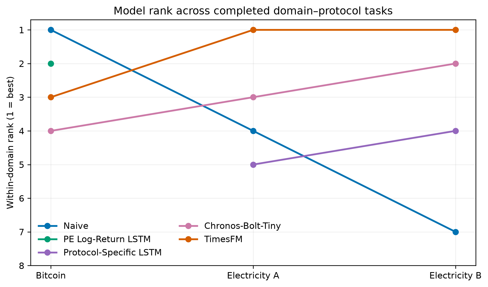
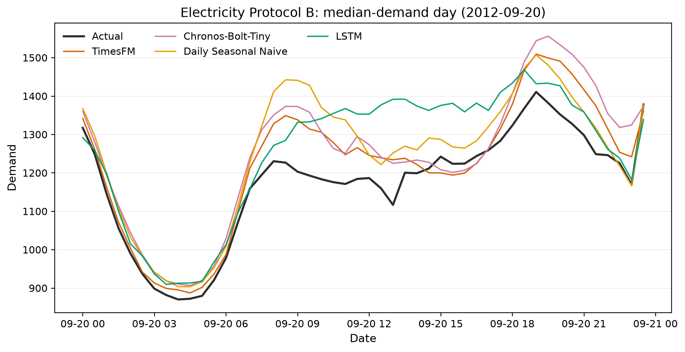
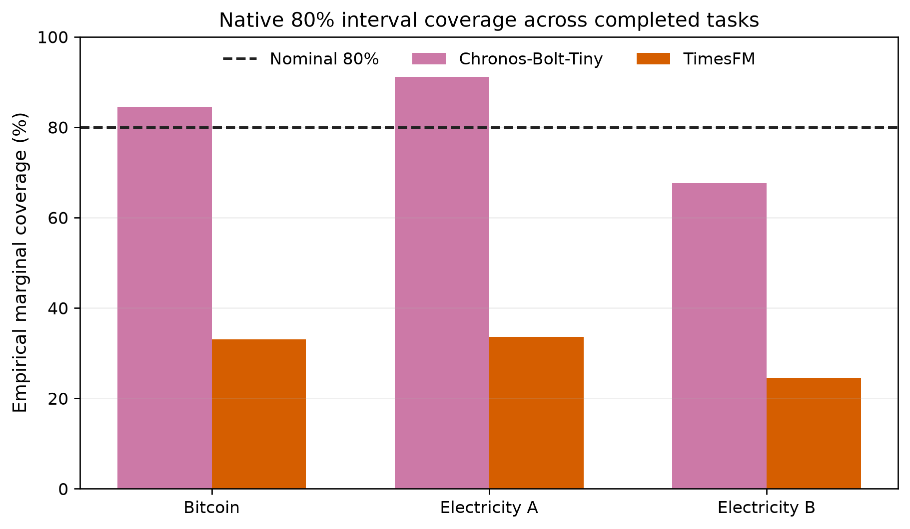

# Trustworthy Foundation Models for Time-Series Forecasting

This research project evaluates time-series foundation models as forecasting systems rather than point-metric contestants. Two completed case studies examine point accuracy, regime-conditional robustness, temporal stability, uncertainty calibration, transparency/auditability, and statistical significance under frozen, leakage-controlled protocols.

## Research Manuscript

[`paper/research_manuscript.md`](paper/research_manuscript.md) is a manuscript-style report of the completed Finance and Energy experiments.

## Key Figures







## Research Objective

The central question is whether zero-shot foundation models are consistently trustworthy across domains and forecast horizons. Chronos-Bolt-Tiny and TimesFM are compared with strong simple baselines, statistical models, and deterministic LSTMs. Exact forecast vectors are frozen before downstream analysis.

## Completed Domains

### Domain 1 — Finance: Bitcoin

**Completed.** Daily Bitcoin Close is evaluated over 1,061 test days with rolling one-step forecasts. The authoritative comparison is `results/validated_forecasts.csv`.

### Domain 2 — Energy: South Australian Electricity Demand

**Completed.** Half-hourly South Australian demand is evaluated over 46,176 observations under rolling one-step Protocol A and 962 non-overlapping 48-step day-ahead origins under Protocol B.

### Domain 3 — Weather

**Planned.** This is the recommended next domain.

### Domain 4 — Transport

**Planned.** Protocol and dataset selection have not begun.

## Models Evaluated

- **Baselines:** Naive persistence, daily and weekly seasonal naive, moving average.
- **Statistical:** Bitcoin rolling ARIMA, Simple Exponential Smoothing, additive-trend non-seasonal Holt-Winters, and periodic-refit Prophet; electricity DHR-ARIMA.
- **Deep learning:** Bitcoin Persistence-Enhanced LSTM and protocol-specific electricity LSTMs.
- **Foundation models:** zero-shot Chronos-Bolt-Tiny and TimesFM.
- **Unavailable/optional:** Moirai/Uni2TS, PatchTST, and iTransformer have no authoritative results.

## Evaluation Framework

- **Accuracy:** MAE, RMSE, MAPE, sMAPE, Bitcoin MASE-1, and electricity MASE-48.
- **Regime-Conditional Robustness:** predeclared demand/volatility or market regimes; not comprehensive adversarial robustness.
- **Temporal Stability:** contiguous chronological test segments; not broad cross-dataset or out-of-distribution generalisation.
- **Uncertainty:** supported native intervals, empirical coverage, and width.
- **Transparency and Auditability:** interpretation, complexity, reproducibility, and failure detectability; not direct XAI.
- **Statistical significance:** protocol-appropriate Diebold–Mariano tests.

Dimension-level evidence is primary. The secondary **Exploratory Composite Trustworthiness Summary** retains researcher-defined 35/20/20/15/10 weights. Components are not statistically independent, normalisation depends on the comparison set, and neither summary is a universal measurement instrument.

## Key Bitcoin Results

| Rank | Model | MAE | RMSE | MAPE | sMAPE |
|---:|---|---:|---:|---:|---:|
| 1 | Naive | 1290.353242 | 1853.624774 | 1.742747 | 1.744142 |
| 2 | Simple Exponential Smoothing Rolling One-Step | 1290.358684 | 1855.731424 | 1.742685 | 1.743871 |
| 3 | ARIMA Rolling One-Step | 1299.874638 | 1866.302859 | 1.754004 | 1.754209 |
| 4 | Holt-Winters Rolling One-Step | 1308.541314 | 1871.702185 | 1.763640 | 1.763424 |
| 5 | Persistence-Enhanced LSTM | 1321.365311 | 1881.091190 | 1.783956 | 1.791645 |
| 6 | TimesFM | 1349.946786 | 1924.199337 | 1.823179 | 1.823895 |
| 7 | Chronos-Bolt-Tiny | 1424.025828 | 1994.007926 | 1.934509 | 1.928782 |
| 8 | Prophet 30-Day Periodic Refit | 8195.262862 | 10781.162873 | 11.199767 | 11.287185 |

Naive remains the lowest-RMSE model. Its differences from Simple Exponential Smoothing (`p = 0.666843`), Holt-Winters (`p = 0.067710`), and rolling ARIMA (`p = 0.308442`) are not significant. Both smoothing models significantly outperform TimesFM, Chronos, and Prophet. Training-only conformal calibration changed Chronos 80% test coverage from 84.54% to 81.53% and TimesFM from 33.08% to 55.61%; TimesFM remains materially under-covered.

The significance analysis covers all 36 pairs among the nine Trust Score models. Eight vectors come from the validated artifact; the 7-Day Moving Average is reconstructed deterministically from seven strictly prior observations, matching Notebook 06.

After applying the same validation-residual empirical uncertainty method to ARIMA and both smoothing models, Naive leads both Trust Score variants at `97.803780`; Simple Exponential Smoothing ranks second at `97.466671`, followed by Holt-Winters at `96.579302` and ARIMA at `96.545355`.

The variants are ranked independently because missing uncertainty evidence changes the PE-LSTM result.

| Penalised Rank | Model | Missing-Evidence-Penalised Score |
|---:|---|---:|
| 1 | Naive | 97.803780 |
| 2 | Simple Exponential Smoothing Rolling One-Step | 97.466671 |
| 3 | Holt-Winters Rolling One-Step | 96.579302 |
| 4 | ARIMA Rolling One-Step | 96.545355 |
| 5 | Chronos-Bolt-Tiny | 91.312313 |
| 6 | TimesFM | 90.521931 |
| 7 | Persistence-Enhanced LSTM | 79.600601 |
| 8 | 7-Day Moving Average | 70.724359 |
| 9 | Prophet 30-Day Periodic Refit | 22.624980 |

| Evidence-Available Rank | Model | Evidence-Available Score |
|---:|---|---:|
| 1 | Naive | 97.803780 |
| 2 | Simple Exponential Smoothing Rolling One-Step | 97.466671 |
| 3 | Holt-Winters Rolling One-Step | 96.579302 |
| 4 | ARIMA Rolling One-Step | 96.545355 |
| 5 | Persistence-Enhanced LSTM | 93.647766 |
| 6 | Chronos-Bolt-Tiny | 91.312313 |
| 7 | TimesFM | 90.521931 |
| 8 | 7-Day Moving Average | 70.724359 |
| 9 | Prophet 30-Day Periodic Refit | 26.617624 |

## Key Electricity Results

| Rank | Protocol A: rolling one-step | MASE-48 | Protocol B: 48-step day-ahead | MASE-48 |
|---:|---|---:|---|---:|
| 1 | TimesFM | 0.1400 | TimesFM | 0.6892 |
| 2 | DHR-ARIMA | 0.2276 | Chronos-Bolt-Tiny | 1.0774 |
| 3 | Chronos-Bolt-Tiny | 0.2762 | Daily Seasonal Naive | 1.1056 |
| 4 | Naive | 0.3611 | LSTM | 1.3064 |
| 5 | LSTM | 0.4017 | Weekly Seasonal Naive | 1.3088 |
| 6 | Daily Seasonal Naive | 1.1056 | Moving Average | 1.7359 |
| 7 | Weekly Seasonal Naive | 1.3088 | Naive | 2.0831 |
| 8 | Moving Average | 1.5302 | DHR-ARIMA | 2.4557 |

TimesFM leads both protocols and beats their strongest baselines by about 38%. Chronos 80% coverage is approximately 91.1% and 67.6%; TimesFM coverage is approximately 33.6% and 24.6%.

## Cross-Domain Findings

- TimesFM ranks third and trails Naive by about 4.6% in Bitcoin, but ranks first in both electricity protocols.
- Chronos has substantially lower absolute error from nominal 80% marginal coverage than TimesFM in every completed task; width and sharpness still matter.
- Strong baselines remain essential: persistence dominates Bitcoin, DHR-ARIMA is strong one-step, and Daily Seasonal Naive is strong day-ahead.
- In the completed tasks, rankings vary across dataset, domain, frequency, and forecasting protocol; one dataset per domain prevents isolation of a pure domain effect.
- Model complexity and point accuracy do not imply calibrated uncertainty or universal trustworthiness.

Raw Bitcoin and electricity MAE/RMSE values are never compared directly because their units and scales differ.

## Repository Structure

```text
TimeSeriesFoundationModels/
├── data/                         # Local datasets and dataset notes
├── docs/                         # Protocols, case studies, findings, environment, status
├── figures/
│   ├── bitcoin/                  # Bitcoin publication and diagnostic figures
│   ├── electricity/              # Protocol-specific electricity figures
│   └── cross_domain/             # Cross-domain synthesis figures
├── notebooks/
│   └── electricity/              # Electricity phases 1–9
├── paper/                        # Main research manuscript and references
├── proposal/                     # Research proposal
├── results/
│   └── electricity/              # Frozen forecasts and evidence by protocol
├── src/                          # Reusable loading, preprocessing, metrics, plots
├── requirements-research.txt     # Authoritative direct dependencies
└── requirements.txt              # Historical minimal environment file
```

## Notebook Guide

| Notebook | Status | Purpose |
|---|---|---|
| `Bitcoin_Master.ipynb` | MASTER / RECOMMENDED ENTRY POINT | Safe Bitcoin orchestration, validation, and artifact-based analysis |
| `Electricity_Master.ipynb` | MASTER / RECOMMENDED ENTRY POINT | Safe Electricity orchestration, validation, and artifact-based analysis |
| `01_EDA.ipynb` | AUTHORITATIVE | Bitcoin data audit and daily preparation |
| `02_Classical_Models.ipynb` | PROTOCOL-LIMITED / HISTORICAL | Classical Bitcoin forecasts without equivalent frozen rolling vectors |
| `03_Deep_Learning_LSTM.ipynb` | EXPLORATORY | Raw-price LSTM |
| `03b_LSTM_Improved.ipynb` | EXPLORATORY | Improved experimental LSTM |
| `04_Transformers.ipynb` | EXPLORATORY | Failed/collapsed Transformer case study |
| `05_Advanced_Forecasting_Models.ipynb` | AUTHORITATIVE GENERATION — COMPLETE ADVANCED MODEL SET | Rolling ARIMA, Simple Exponential Smoothing, and Holt-Winters plus periodic-refit Prophet; SARIMA omitted and neural models deferred |
| `05_Foundation_Models.ipynb` | AUTHORITATIVE GENERATION | Bitcoin foundation-model evidence |
| `06_Trustworthiness.ipynb` | AUTHORITATIVE ANALYSIS | Bitcoin multidimensional trust evaluation |
| `07_Model_Validation_Audit.ipynb` | AUTHORITATIVE AUDIT | Bitcoin saved-vector validation |
| `08_Naive_Forecast_Audit.ipynb` | AUTHORITATIVE AUDIT | Persistence verification |
| `09_Statistical_Significance_Test.ipynb` | AUTHORITATIVE ANALYSIS | Bitcoin DM tests |
| `electricity/10_Electricity_EDA.ipynb` | AUTHORITATIVE | Dataset selection and audit |
| `electricity/11_Electricity_Baselines.ipynb` | AUTHORITATIVE GENERATION | Protocol-specific deterministic baselines |
| `electricity/11b_Electricity_Statistical_Model.ipynb` | AUTHORITATIVE GENERATION | DHR-ARIMA |
| `electricity/12_Electricity_LSTM.ipynb` | AUTHORITATIVE GENERATION | Deterministic LSTM forecasts |
| `electricity/13_Electricity_Foundation_Models.ipynb` | AUTHORITATIVE GENERATION | Zero-shot Chronos and TimesFM |
| `electricity/14_Electricity_Model_Validation_Audit.ipynb` | AUTHORITATIVE AUDIT | Protocol and vector audit |
| `electricity/15_Electricity_Trustworthiness_Evidence.ipynb` | ARTIFACT-ONLY ANALYSIS (saved without outputs) | Regime-conditional robustness, temporal stability, and uncertainty evidence |
| `electricity/16_Electricity_Trustworthiness.ipynb` | ARTIFACT-ONLY ANALYSIS (saved without outputs) | Exploratory composite scores and sensitivity |
| `electricity/17_Electricity_Statistical_Significance.ipynb` | AUTHORITATIVE ANALYSIS | Protocol-specific DM tests |
| `18_Cross_Domain_Comparison.ipynb` | AUTHORITATIVE SYNTHESIS | Artifact-only two-domain comparison |

Inserted names `03b` and `11b` preserve historical phase order; notebooks are intentionally not renamed.

Use the master notebooks for routine inspection and artifact-based analysis. Use the phase-specific notebooks for model generation, audits, and historical implementation detail. Both master notebooks default to safe mode and do not load or train forecasting models.

## Authoritative Artifacts

- Bitcoin: `results/validated_forecasts.csv`
- Electricity A: `results/electricity/protocol_a_validated_forecasts.csv`
- Electricity B: `results/electricity/protocol_b_validated_forecasts.csv`
- Bitcoin trust evidence: `bitcoin_trust_scores_penalised.csv` and `bitcoin_trust_scores_evidence_available.csv`
- Statistical evidence: `bitcoin_dm_pairwise_results.csv` plus electricity protocol-specific DM and effect-size CSVs
- Cross-domain: the four `results/cross_domain_*.csv` files

The complete protected set and SHA-256 values are in [`results/authoritative_artifact_hashes.md`](results/authoritative_artifact_hashes.md). See [`results/README.md`](results/README.md) for artifact classification.

## Reproducibility

Do not overwrite frozen artifacts during routine notebook execution. Downstream audit, trustworthiness, significance, and synthesis work loads saved forecast vectors. Several audit/analysis notebooks are intentionally saved without execution outputs; their authoritative evidence is the frozen CSV set, not a claimed executed notebook state. Protocols use chronological splits, past-only information, validation-only selection, deterministic LSTM controls, and exact timestamp alignment. Run `python src/verify_research_artifacts.py` for lightweight artifact-level verification.

Start with:

```powershell
python -m venv .venv
.\.venv\Scripts\Activate.ps1
pip install -r requirements-research.txt
```

## Environment

The audited completed environment is CPU-only Windows 11 build 26100 with Python 3.13.2. [`requirements-research.txt`](requirements-research.txt) is authoritative for direct research dependencies. Notebook tooling must be installed explicitly because the audited workstation resolves some Jupyter components outside `.venv`. Chronos-Bolt-Tiny and TimesFM inference completed on CPU. Moirai / Uni2TS was unavailable in the completed Python 3.13 workflow; PatchTST and iTransformer require an isolated Python 3.12 environment and have no authoritative forecasts. Artifact-only verification does not require model checkpoints.

## Limitations

Only two domains, one Bitcoin asset, and one electricity region are complete. Frequencies, targets, horizons, and LSTM formulations differ; single deterministic runs do not quantify seed uncertainty. Composite weights and transparency/auditability scores are researcher-defined. Supported uncertainty quantiles are limited. Moirai is absent, while PatchTST and iTransformer are outside the authoritative comparison and are not assumed to be zero-shot foundation models. No foundation model is fine-tuned.

## Future Work

Weather is the recommended next case study, followed by Transport. Other priorities are additional electricity regions, foundation-model scaling, and compatible Python 3.12 evaluation of Moirai, PatchTST, and iTransformer.

Detailed reports: [`Bitcoin case study`](docs/bitcoin_case_study.md) and [`Electricity case study`](docs/electricity_case_study.md). The primary cross-domain narrative is the [`research manuscript`](paper/research_manuscript.md).
