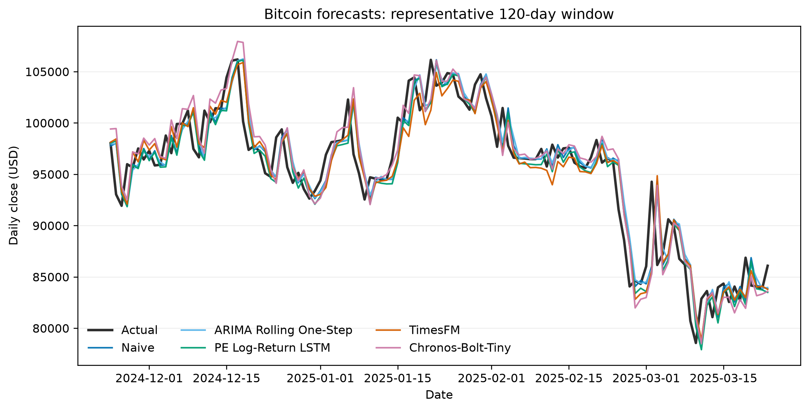
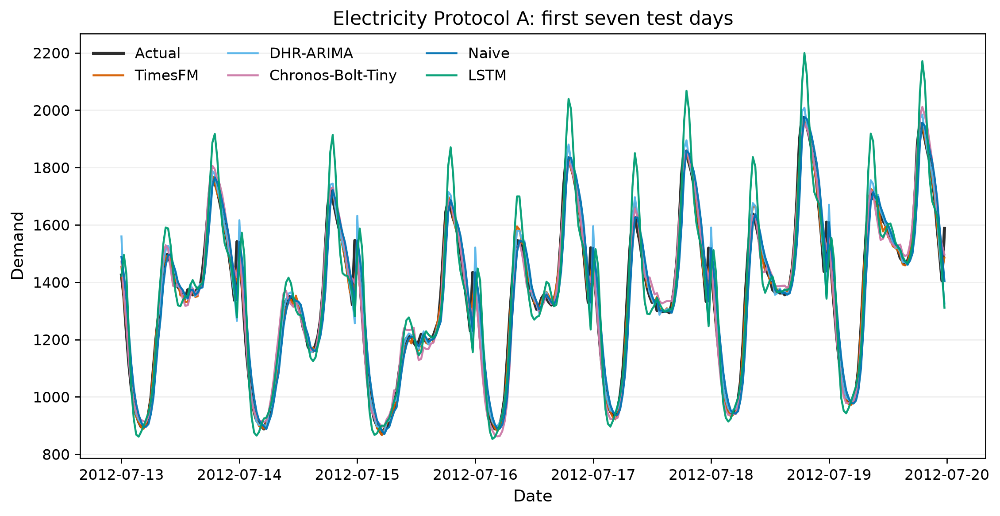
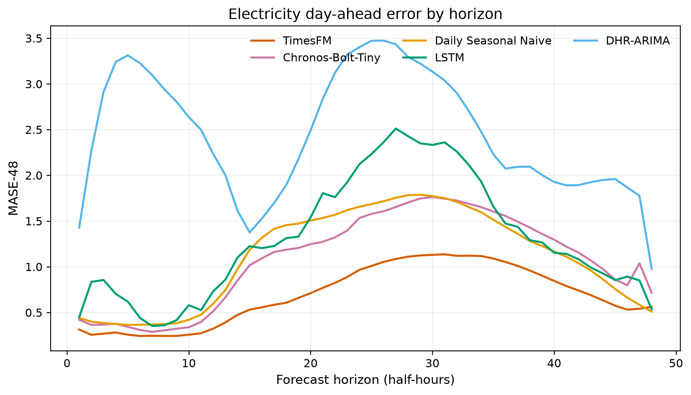

# Trustworthy Foundation Models for Time-Series Forecasting: A Cross-Domain Study of Finance and Energy

## Abstract

Time-series foundation models (TSFMs) promise reusable zero-shot forecasting, yet point accuracy alone does not establish operational trustworthiness. This study evaluates Chronos-Bolt-Tiny and the repository's TimesFM checkpoint against simple baselines, statistical models, and domain-adapted LSTMs for daily Bitcoin prices and half-hourly South Australian electricity demand. Frozen chronological protocols include Bitcoin rolling one-step forecasting and electricity rolling one-step and true 48-step day-ahead forecasting. Primary evidence comprises point accuracy, regime-conditional robustness, temporal stability, native 80% marginal-coverage calibration, transparency and auditability, and dependence-aware statistical tests. Naive persistence ranks first for Bitcoin, whereas TimesFM ranks first under both electricity protocols. DHR-ARIMA is strong one-step and Daily Seasonal Naive remains competitive day-ahead. Chronos has lower absolute error from nominal 80% coverage than TimesFM in all three tasks, although coverage alone does not establish universal calibration superiority. In the completed tasks, rankings vary across dataset, domain, frequency, and forecasting protocol. An exploratory composite is retained only as secondary, sensitivity-oriented synthesis. The evidence is limited to two datasets and cannot identify a pure domain effect or establish universal model superiority.

## 1. Introduction

Large pretrained forecasting models seek to transfer patterns learned from heterogeneous time series without task-specific fitting. Chronos, TimesFM, and Moirai have made zero-shot forecasting a credible alternative to conventional per-domain development (Ansari et al., 2024; Das et al., 2024; Woo et al., 2024). Deployment decisions, however, require more than a leaderboard. Forecast reliability can change with persistence, seasonality, volatility, forecast horizon, permissible information updates, and interval construction.

This completed preliminary study asks whether TSFM ranks are stable across domains; how temporal structure affects performance; when TSFMs significantly beat strong baselines; whether intervals are calibrated; whether complexity aligns with trustworthiness; and how horizon changes conclusions. Finance and Energy supply contrasting dynamics. The contribution is an integrated, protocol-aware empirical analysis with frozen vectors—not a claim that cross-domain TSFM benchmarking is absent.

*Figure 1. Within-task ranks for shared model families.*

## 2. Related Work

### 2.1 Modern Time-Series Forecasting

RevIN targets distribution changes in input/output statistics (Kim et al., 2022). PatchTST uses channel-independent temporal patches and supports supervised and self-supervised transfer (Nie et al., 2023), while iTransformer treats whole variate histories as tokens (Liu et al., 2024). These are important supervised architectures, not automatically general-purpose foundation models. Linear-baseline evidence warns that complexity does not guarantee improvement (Zeng et al., 2023).

### 2.2 Time-Series Foundation Models

Chronos tokenises scaled observations and samples probabilistic trajectories; TimesFM uses a patched decoder-only model; Moirai combines a masked encoder, multiple patch sizes, any-variate attention, and distributional outputs. Their heterogeneous benchmarks establish broad capability within declared experiments, not universal superiority. This study uses Chronos-Bolt-Tiny, a patch-based direct-quantile variant.

### 2.3 Regime-Conditional Robustness and Temporal Stability

Cloud and regime-balanced evaluations show dataset, context, and regime dependence (Toner et al., 2025; Xue et al., 2026). This motivates stratified regimes and contiguous temporal segments. The present regimes are predefined conditional-performance slices, not comprehensive adversarial robustness. Chronological segments measure stability inside the held-out period; they do not demonstrate geographic, cross-dataset, out-of-distribution, or structural-break generalisation.

### 2.4 Probabilistic Calibration

Calibration and sharpness are distinct: narrow intervals help only when coverage is adequate. Current TSFM evidence shows calibration varies across models, heads, and horizons (Adler et al., 2026). Coverage and width are therefore reported separately from point error.

### 2.5 Forecast Evaluation and Benchmark Integrity

Chronological splitting, appropriate horizons, strong baselines, and overlap disclosure are essential (Hewamalage et al., 2023; Meyer et al., 2025). Exact saved vectors and audits preserve the evidence used here.

## 3. Datasets

| Domain | Source series | Native frequency | Target | Test evidence |
|---|---|---|---|---|
| Bitcoin | Local BTC/USD minute OHLCV file | 1 minute, resampled daily | Daily Close | 1,061 days, 2023-08-12 to 2026-07-07 |
| Electricity | Australian Electricity Demand, South Australia T4 | 30 minutes | Demand | 46,176 observations / 962 days, 2012-07-13 to 2015-03-01 |

### 3.1 Bitcoin

Minute OHLCV observations are sorted, converted from Unix seconds to UTC, and resampled to daily OHLCV; daily Close is the target. The repository does not retain a verified original download URL or licence record, so provider provenance is not inferred. The raw 386 MB file is local and Git-ignored.

### 3.2 Australian Electricity Demand

The T4 series represents South Australia. Its half-hourly index is contiguous with no audited missing, duplicate, negative, or zero observations. Partitions align to complete days.

## 4. Experimental Design

### 4.1 Chronological splitting

All partitions are chronological. Training, scaling, early stopping, choice, and calibration decisions exclude final-test outcomes.

### 4.2 Bitcoin protocol

Bitcoin provides authoritative rolling one-step daily evidence only. Each actual becomes available only after its forecast; no authoritative long-horizon Bitcoin claim is made.

### 4.3 Electricity Protocol A

Protocol A is rolling one-step prediction at 30 minutes over 46,176 timestamps.

### 4.4 Electricity Protocol B

Protocol B contains 962 midnight origins, each producing 48 forecasts without within-day actual updates.

### 4.5 Leakage prevention and artifact validation

Tables are validated for keys, shape, timestamp alignment, finiteness, and information-set semantics. Hashes freeze authoritative artifacts; this manuscript requires no model re-execution.

## 5. Models

### 5.1 Naive / seasonal baselines

Persistence, daily and weekly seasonal naive, and moving-average forecasts encode credible domain structure.

### 5.2 DHR-ARIMA

Electricity DHR-ARIMA combines preselected daily/weekly Fourier terms with non-seasonal ARIMA errors. It is not in the common Bitcoin saved-vector comparison.

### 5.3 LSTM

Bitcoin's authoritative neural model is the Persistence-Enhanced Log-Return LSTM represented by its frozen validated vector. Electricity uses protocol-specific deterministic LSTMs. They are one family but not identical architectures, and single deterministic runs do not quantify training-seed uncertainty.

### 5.4 Chronos-Bolt-Tiny

Chronos-Bolt-Tiny is evaluated zero-shot with native quantiles and a frozen electricity context of 336 observations.

### 5.5 TimesFM

TimesFM 2.5 is evaluated zero-shot under the same electricity context policy. Installed-model intervals are assessed as produced.

## 6. Evaluation

### 6.1 Point forecast metrics

MAE, RMSE, MAPE, and sMAPE are reported; electricity also uses daily-seasonal MASE-48. Cross-domain synthesis uses ranks and baseline-relative changes, not raw units.

### 6.2 Regime-Conditional Robustness

Predeclared market movement/volatility and electricity demand/volatility regimes test heterogeneous conditions. Scores are relative, not absolute guarantees. The study does not test adversarial perturbations, sensor corruption, missing-data attacks, synthetic distribution shift, or controlled covariate shift.

### 6.3 Temporal Stability

Earlier, Middle, and Later contiguous segments assess the stability of forecasting performance across the held-out period while preserving complete day-ahead origins. This is not broad domain or out-of-distribution generalisation.

### 6.4 Uncertainty

Native 80% marginal intervals are evaluated using empirical coverage, absolute coverage error, and width. Coverage alone is insufficient: sharpness matters, and wider intervals may improve coverage. Only one primary nominal level is available; missing intervals remain unavailable and unsupported 95% intervals are not inferred.

### 6.5 Transparency and Auditability

Model transparency, ease of interpretation, computational complexity, reproducibility, and failure detectability form a researcher-defined rubric. These properties support trustworthy assessment but are not direct XAI: the study does not test feature-attribution faithfulness, counterfactuals, representation probes, saliency validation, or user-centred explanation quality.

### 6.6 Diebold–Mariano testing

Paired loss tests use HAC variance. Protocol B aggregates by daily origin; Benjamini–Hochberg correction and effect sizes supplement p-values.

## 7. Bitcoin Results

| Rank | Model | MAE | RMSE | sMAPE (%) |
|---:|---|---:|---:|---:|
| 1 | Naive | 1290.35 | 1853.62 | 1.7441 |
| 2 | Persistence-Enhanced Log-Return LSTM | 1321.37 | 1881.09 | 1.7916 |
| 3 | TimesFM | 1349.95 | 1924.20 | 1.8239 |
| 4 | Chronos-Bolt-Tiny | 1424.03 | 1994.01 | 1.9288 |

Naive significantly beats both foundation models. TimesFM significantly beats Chronos; Persistence-Enhanced Log-Return LSTM–TimesFM is not significant at 5% (`p = 0.056421`). Chronos coverage is 84.5%, versus TimesFM’s 33.1%.

*Figure 2. Deterministic central 120-day window.*

## 8. Electricity Results

### 8.1 Protocol A

| Rank | Model | MASE-48 |
|---:|---|---:|
| 1 | TimesFM | 0.1400 |
| 2 | DHR-ARIMA | 0.2276 |
| 3 | Chronos-Bolt-Tiny | 0.2762 |
| 4 | Naive | 0.3611 |
| 5 | LSTM | 0.4017 |

TimesFM significantly beats DHR-ARIMA and Chronos. Chronos coverage is 91.1%; TimesFM coverage is 33.6%.

*Figure 3. First seven test days, selected independently of error.*

### 8.2 Protocol B

| Rank | Model | MASE-48 |
|---:|---|---:|
| 1 | TimesFM | 0.6892 |
| 2 | Chronos-Bolt-Tiny | 1.0774 |
| 3 | Daily Seasonal Naive | 1.1056 |
| 4 | LSTM | 1.3064 |
| 8 | DHR-ARIMA | 2.4557 |

TimesFM significantly beats Chronos and Seasonal Naive under daily squared loss. Chronos significantly beats the seasonal baseline under that loss, with a more cautious absolute-loss sensitivity. Coverage is 67.6% for Chronos and 24.6% for TimesFM.

*Figure 4. Median-mean-demand test day, selected independently of forecast error.*

### 8.3 Horizon-specific behaviour

DHR-ARIMA changes from second one-step to last day-ahead, demonstrating horizon/protocol sensitivity rather than establishing general model failure. Daily seasonality becomes a stronger day-ahead benchmark.

*Figure 5. Day-ahead MASE-48 by horizon.*

## 9. Cross-Domain Findings

TimesFM changes from third in Bitcoin to first in both electricity protocols. Naive wins Bitcoin, while electricity requires horizon-specific baselines. Chronos never leads point accuracy but has lower absolute error from nominal 80% marginal coverage in all three tasks. In these completed tasks, rankings vary across dataset, domain, frequency, and forecasting protocol. With one dataset per domain, these effects cannot be separated cleanly from horizon, target semantics, or evaluation period.

*Figure 6. Native coverage against nominal 80%.*

*Figure 7. Component-level evidence for the evaluated TSFMs. Values remain task-specific and are not aggregated into a composite.*

## 10. Trustworthiness Evidence and Exploratory Composite Synthesis

Primary evidence is ordered as point accuracy; regime-conditional robustness; temporal stability; uncertainty calibration; transparency and auditability; and statistical significance/practical effect. Figure 7 exposes those components without collapsing them.

The secondary **Exploratory Composite Trustworthiness Summary** retains the frozen weights: Accuracy 35%, Robustness 20%, Temporal Stability 20%, Uncertainty 15%, and Transparency/Auditability 10%. Underlying CSV columns retain historical labels to preserve authoritative artifacts. Weights are researcher-defined, components are not statistically independent, and normalisation depends on the comparison set. The **Overall Trust Score — Missing Evidence Penalised** and **Evidence-Available Trust Score** are sensitivity-oriented summaries, not validated measurement instruments. Missing uncertainty evidence is not measured poor calibration.

## 11. Discussion

Zero-shot transfer can succeed for structured demand while failing to beat persistence in a volatile price series. Operational horizon changes the competitive set, and marginal coverage can reverse the practical interpretation of point rankings. A lower error does not justify overconfidence; wider intervals do not erase point error. Conclusions apply specifically to Chronos-Bolt-Tiny and the TimesFM checkpoint used here. Moirai was excluded by environment/model-scope constraints; PatchTST and iTransformer were not in the authoritative comparison and are not treated as zero-shot foundation models by default.

## 12. Threats to Validity

### Internal Validity

Frozen information sets, exact keys, and artifact audits reduce leakage and alignment risks. Nevertheless, implementations, context policies, validation choices, and model families differ. LSTMs are deterministic single runs rather than seed distributions, and artifact hashes preserve outputs without independently proving every upstream generation step.

### Construct Validity

Regime-conditional robustness is narrower than adversarial robustness. Temporal Stability is not geographic, cross-dataset, out-of-distribution, or structural-break generalisation. Transparency/Auditability is not direct XAI. Native uncertainty evidence is limited to available quantiles and one primary nominal level. Composite weights are researcher-defined, overlapping components are not statistically independent, and normalisation depends on the comparison set.

### External Validity

Evidence covers one Bitcoin asset, one electricity region, two completed domains, different frequencies, targets, and horizons. These differences prevent clean separation of domain, dataset, frequency, target-semantic, horizon, and evaluation-period effects. Coverage of TSFM families and scales is limited.

### Statistical Conclusion Validity

DM conclusions depend on the loss function, HAC assumptions, and comparison family. Benjamini–Hochberg adjustment controls reported electricity families, while extremely small p-values do not imply large practical effects. Protocol B daily aggregation respects the operational unit but can conceal horizon-specific variation.

### Foundation-Model Benchmark Validity

Unknown pretraining overlap cannot be fully excluded. Results depend on precise checkpoints, installed versions, context policy, and the zero-shot scope. They do not establish properties of all foundation models. Bitcoin provider/licence provenance also requires confirmation before raw-data redistribution.

## 13. Future Work

Weather and Transport remain planned studies; no dataset or result is claimed here. Additional electricity regions, validation-only conformal calibration, direct XAI with faithfulness tests, runtime/resource measurement, multiple neural seeds, and compatible TSFMs are planned extensions.

## 14. Conclusion

The evaluated TSFMs are neither uniformly dominant nor uniformly unreliable. TimesFM is strong for electricity but loses to persistence on Bitcoin and its native 80% intervals under-cover. Chronos is less point-accurate but has substantially lower absolute 80% marginal-coverage error across the three tasks; this does not establish universal calibration superiority. Strong baselines, frozen protocols, horizon-aware tests, exact artifacts, and primary component evidence expose these trade-offs without relying on a composite score.

## References

Adler, C., Chang, Y., Draxler, F., Abdi, S., & Smyth, P. (2026). Beyond accuracy: Are time series foundation models well-calibrated? *ICLR*. https://openreview.net/forum?id=nGBN7UjHcy

Ansari, A. F., et al. (2024). Chronos: Learning the language of time series. *TMLR*. https://openreview.net/forum?id=gerNCVqqtR

Das, A., Kong, W., Sen, R., & Zhou, Y. (2024). A decoder-only foundation model for time-series forecasting. *ICML*. https://proceedings.mlr.press/v235/das24c.html

Hewamalage, H., Ackermann, K., & Bergmeir, C. (2023). Forecast evaluation for data scientists. *Data Mining and Knowledge Discovery, 37*, 788–832. https://doi.org/10.1007/s10618-022-00894-5

Kim, T., et al. (2022). Reversible instance normalization for accurate time-series forecasting against distribution shift. *ICLR*. https://openreview.net/forum?id=cGDAkQo1C0p

Liu, Y., et al. (2024). iTransformer: Inverted transformers are effective for time series forecasting. *ICLR*. https://openreview.net/forum?id=JePfAI8fah

Meyer, M., Kaltenpoth, S., Zalipski, K., & Müller, O. (2025). Time series foundation models: Benchmarking challenges and requirements. *arXiv:2510.13654*. https://arxiv.org/abs/2510.13654

Nie, Y., Nguyen, N. H., Sinthong, P., & Kalagnanam, J. (2023). A time series is worth 64 words. *ICLR*. https://openreview.net/forum?id=Jbdc0vTOcol

Toner, W., Lee, T. L., Joosen, A., Singh, R., & Asenov, M. (2025). Performance of zero-shot time series foundation models on cloud data. *PMLR 296*. https://proceedings.mlr.press/v296/toner25a.html

Woo, G., Liu, C., Kumar, A., Xiong, C., Savarese, S., & Sahoo, D. (2024). Unified training of universal time series forecasting transformers. *ICML*. https://icml.cc/virtual/2024/poster/33767

Xue, S., et al. (2026). QuitoBench: A high-quality open time series forecasting benchmark. *arXiv:2603.26017*. https://arxiv.org/abs/2603.26017

Zeng, A., Chen, M., Zhang, L., & Xu, Q. (2023). Are transformers effective for time series forecasting? *AAAI, 37*(9), 11121–11128. https://doi.org/10.1609/aaai.v37i9.26317

The complete verified bibliography is maintained in [`references.md`](references.md).
